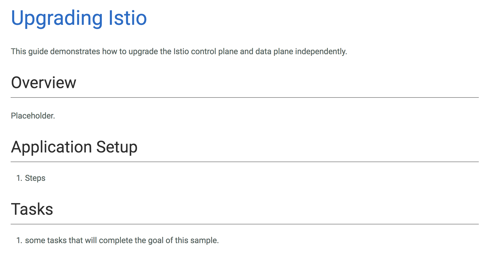

# Services Meshes with Istio and Linkerd
Alex Withrow
[awithrow@gmail.com](mailto:awithrow@gmail.com)
[linkedin](www.linkedin.com/in/alex-withrow)
[https://github.com/awwithro/istio-linkerd-demo](https://github.com/awwithro/istio-linkerd-demo)

---
# What is a Service Mesh?
---
* System for handling inter-service communication
* Works with service discovery
* Adds control and visibility
* Can be used to manage policy and security
* Can provide metrics for service communication
---
Removes routing & infrastructure concerns out of application code
---
"The explicit goal of the service mesh is to move service communication out of the realm of the invisible, implied infrastructure, and into the role of a first-class member of the ecosystem—where it can be monitored, managed and controlled." -- [William Morgan](https://buoyant.io/2017/04/25/whats-a-service-mesh-and-why-do-i-need-one/)
---
# Istio Overview
---
## Istio
* Uses the Envoy proxy under the hood.
* Envoy was developed at Lyft as their service proxy
* Istio adds management an kubernetes integration on-top of Envoy
* Designed for kubernetes primarily
* Acts as an invisible proxy. Traffic is forwarded via IPTables
* Manages rules with kubernetes api through CustomResourceDefinitions (CRDs)
---
## Istio Components
* Sidecar - Envoy proxy that runs in the same pod as a service
* Pilot - Primary Control service. Provides routes/rules/endpoints to sidecars
* Mixer - Allows for extending Istio. Can be used to provide policy, metrics
* Auth - Used for providing mTLS between sidecars.
---
## Istio Architecture

[source](https://istio.io/docs/concepts/what-is-istio/overview.html#architecture)

---
## Sample Route
    apiVersion: config.istio.io/v1alpha2
    kind: RouteRule
    metadata:
      name: my-rule
        spec:
        destination:
            name: my-service
        route:
        - labels:
            version: v1
            weight: 100
---
# Linkerd Overview
---
## Linkerd
* Uses Finagle under the hood
* Finagle developed at Twitter as an RPC library for the JVM
* Allows services to use Finagle as a proxy. Language agnostic
* Explicit proxy
---
## Linkerd Components
* Linkerd - Primary proxy that handles traffic. Can run as a sidecar or per node.
* Namerd - Centralized service for configuring routing/discovery
* Delegation Tables (Dtabs) - Configuration for translating requests to endpoints
---
## Example dtab

    /http/1.1/GET   => /svc ;
    /svc/my-service => /version/my-service/v1 ;
    /version        => /#/io.l5d.k8s/default/http ;

---
    curl http://my-service/hello-world
---
    /http/1.1/GET   => /svc ;
    /svc/my-service => /version/my-service/v1 ;
    /version        => /#/io.l5d.k8s/default/http ;

request interpreted as

    /http/1.1/GET/my-service/hello-world

matches 

    /http/1.1/GET

becomes 

    /svc/my-service/hello-world
---
    /http/1.1/GET   => /svc ;
    /svc/my-service => /version/my-service/v1 ;
    /version        => /#/io.l5d.k8s/default/http ;

-

    /svc/my-service/hello-world

matches

    /scv/my-service

becomes

    /version/my-service/v1/hello-world
---
    /http/1.1/GET   => /svc ;
    /svc/my-service => /version/my-service/v1 ;
    /version        => /#/io.l5d.k8s/default/http ;

-
    
    /version/my-service/v1/hello-world

matches

    /version

becomes

    /#/io.l5d.k8s/default/http/my-service/v1/hello-world
---
    /#/io.l5d.k8s/default/http/my-service/v1/hello-world

This is a lookup in k8s for:
* In the `default` namespace
* on the port labeled `http`
* an instance of the `my-service` service
* with the version label of `v1`
---

    curl http://my-service/hello-world

becomes

    100.10.25.116:80/hello-world

---
# Istio + Linkerd Comparison
---
## Protocols

|         | HTTP | HTTP2/ gRPC | TCP | Thrift | Mux | Websockets |
|:--------|:----:|:-----:|:----:|:---:|:------:|:---:|:----------:|
| Istio   | :white_check_mark: | :white_check_mark: | :white_check_mark: |:x:| :x:| :white_check_mark: 
| Linkerd | :white_check_mark: | :white_check_mark: | :x: |:white_check_mark: | :white_check_mark: | :x: 

---
## Discovery

|         | Kubernetes | Consul             | Nomad | Marathon| ZK |
|:--------|:----------:|:-------------------:|:----:|:-------:|:--:|
| Istio   | :white_check_mark: | :white_check_mark: | :white_check_mark: | :x: | :x: 
| Linkerd | :white_check_mark: | :white_check_mark: | :x: | :white_check_mark: | :white_check_mark: 

|         | DNS_SRV | Curator | File Based | Eureka|
|:--------|:-------:|:-------:|:----------:|:------:|
| Istio   | :x: | :x: | :x: | :white_check_mark:| 
| Linkerd | :white_check_mark: | :white_check_mark: | :white_check_mark: | :x: |

---
## Routing

|         | Host | Path  | Method | Source | Arbitrary Header|
|:--------|:----:|:-----:|:------:|:------:|:---------------:| 
| Istio   | :white_check_mark: | :white_check_mark: |:white_check_mark:| :white_check_mark: | :white_check_mark:
| Linkerd*| :white_check_mark: | :white_check_mark: | :white_check_mark: | :white_check_mark: | :white_check_mark: 

* Linkerd routing methods are determined per linkerd server

---
## Metrics

|        | Prometheus | StatsD  | StackDriver | Zipkin | InfluxDB |
|:-------|:----:|:-----:|:------:|:------:|:---------------:| 
| Istio  | :white_check_mark: | :white_check_mark: |:white_check_mark:| :white_check_mark: | :x:
| Linkerd| :white_check_mark: | :white_check_mark: | :x: | :white_check_mark: | :white_check_mark: 

---
## Other

|         | mTLS | Fault Injection  | Retries | Policy | Egress |
|:--------|:----:|:-----:|:------:|:------:|:---------------:| 
| Istio  | :white_check_mark: | :white_check_mark: |:white_check_mark:| :white_check_mark: | :white_check_mark:
| Linkerd| :white_check_mark: | :x: | :white_check_mark: | :x: | :x:

---
## Observations
* Linkerd & Envoy are part of the CNCF (not Istio)
* Linkerd more feature complete and stable. Announced (02/16)
* Istio still beta and not quite production ready. Announced (05/17)
* Istio approach more flexible
* Mixer Adapters are a big plus for Istio
* Both have a steep learning curve
---

[source](https://istio.io/docs/guides/upgrading-istio.html)
---
# Istio and Linkerd can be combined!
---
* Linkerd 1.1.1 introduced support for Istio
* Istio provides the control plane
* Linkerd provides the data plane
---
# Demo Time!
---
## The Three Services
* **words**: generates a random word
* **simon**: prints "Simon Says: _word_"
* **capitalizer**: calls either words service or simon service and capitalizes the output 
---
## Demo 1
Basic Service Mesh
---
## Demo 2
Canary Deployment
---
## Demo 3
Errors and Retries
---
## Demo 4
Stealth Deployment
---
# Questions?
---
# Useful Links
---
* [What is a service mesh?](https://buoyant.io/2017/04/25/whats-a-service-mesh-and-why-do-i-need-one/)
* [Istio Docs](https://istio.io/docs/)
* [Linkerd Docs](https://linkerd.io/config/1.3.4/linkerd/index.html)
* [Linkerd vs Istio: my 2¢ – Jeff Gensler](https://medium.com/@jeffzzq/linkerd-vs-istio-my-2-1e16557891a6)